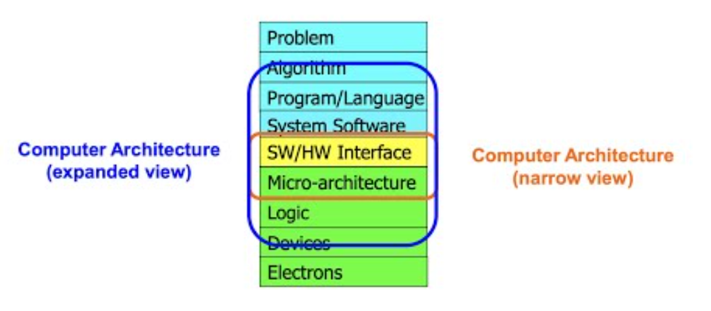
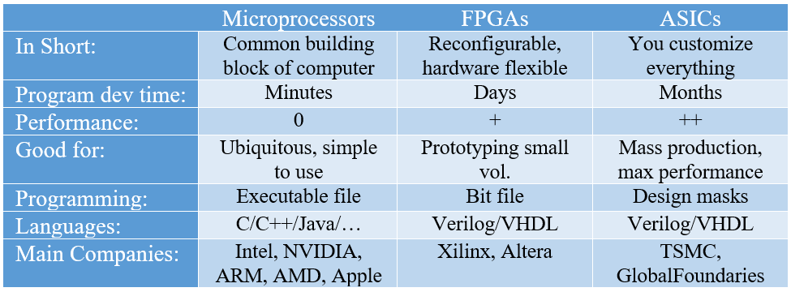

# **MEDS**
## *Digital design and Computer Architecture*
### ***Lecture # 1: Introduction***

**Why do we need computers? **
1. To Compute
2. To Calculate
3. To Solve Problems

**How? **
In todays dominant technology, we orchestrate electrons.

**Transformation heirarchy:**

> *Computer Architecture* is a science and art of designing computing platforms. It's a vast field with "Plenty of room at the bottom and top"

**Why should we study it? **
1. Enable better systems:
    - Faster, smaller and cheaper computers
    - Advances in underlying circuits
2. Enable new applications:
    - Lifelike for instance 3D, VR, genomics etc
3. Enable better solutions:
    - 50% performance improvement per year
4. Understand why computers work the way they do.

**What is a computer? **
1. Processing:
    - Control sequencing 
    - Datapath
2. Memory:
    - Program & Data
3. Input and Output Devices.

**Differences between Hardwares**

Building blocks of modern computers: ***Transistors!*** 
(Small and relatively simple structures)

**MOS transistor: **
A MOS consists of conductors (metals), insulators (oxide) and semiconductors. There are 2 types of MOS transistors called the nMOS and the pMOS. We provide the gate with 3V and the circuit is closed which means the nMOS is enabled, Similarly by providing the inverted voltage (0V) the pMOS is enabled.

> _CMOS = nMOS + pMOS_