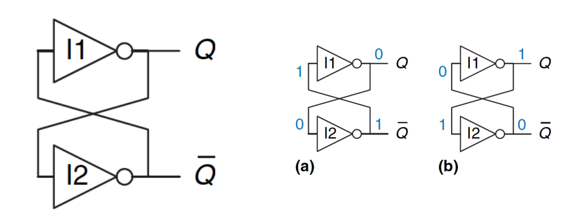
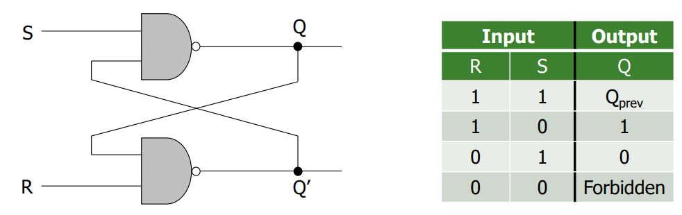
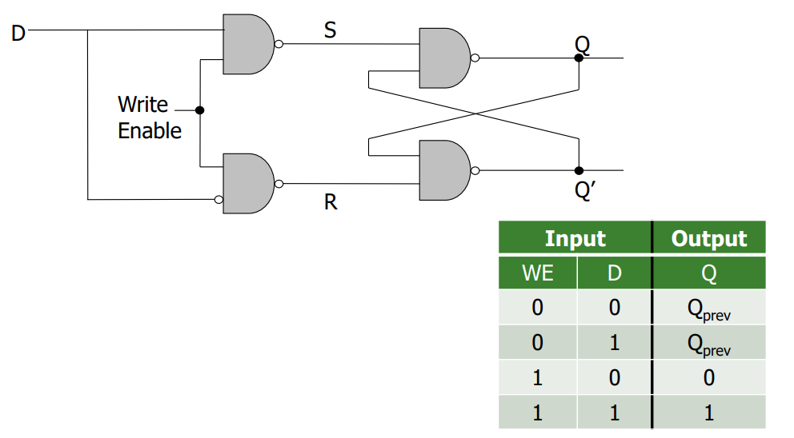
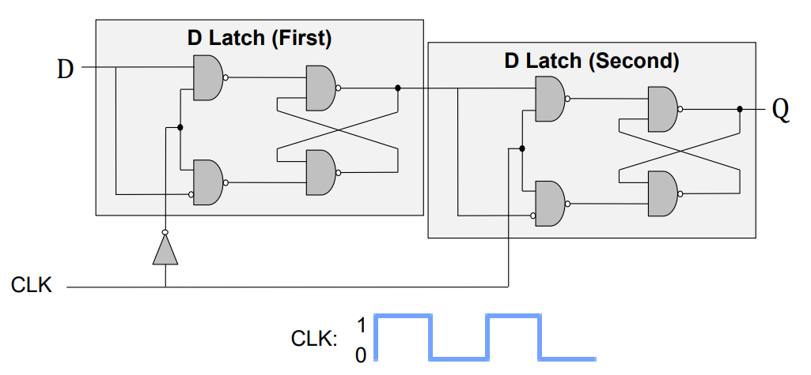
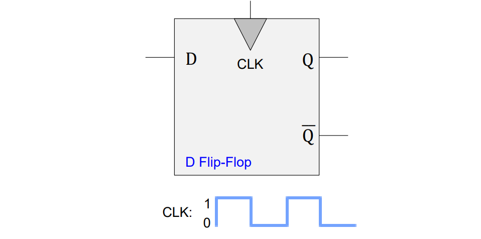
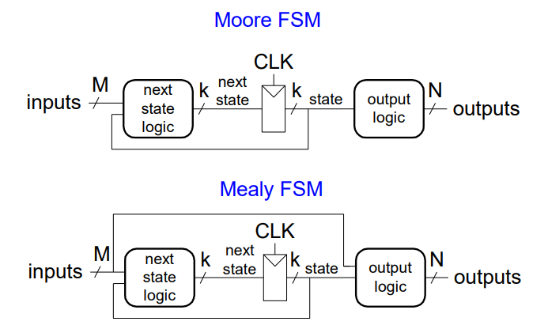

# **MEDS**
## *Digital design and Computer Architecture*
### ***Lecture # 3 and 4 (a): Sequential Logic***

**Sequential Circuits:** 
> Input --> Combinational Circuits + Storage element --> Output

They're basically circuits with memory, producing output depending on
current and past input values.

**Basic Element: Cross-Coupled Inverters** 

- Has two stable states: 
    - Q=1
    - Q=0
- Metastable state  is oscillating between 0 and 1
- Need a control mechanism for Q

**Reset Set Latch:** 

- Cross-coupled NAND gates
- S and R are control inputs
- In idle state both are 1, they should never be zero
- If S and R are both 0, Q = Q' and if they transistion back at the same time they reach metastability

**Gated D Latch:** 

- Q takes the value of D when WE = 1
- By adding 2 more NAND gates, S and R can never be 0 at the same time

**Register:** 
A register is basically a bunch of D latches connected together with a single WE signal for all latches for simultaneous writes

**Memory:**
- Comprises of locations that can be written to and read from
- Unique addressing

**Sequential Logic Circuits:**
- State: A snapshot of all relevant elements of the system at the moment of the snapshot.
- Asynchronous: State transitions occur when they occur
- Synchronous: State transistions take place after fixed units of time
- Clock: General mechanism that triggers transition from one state to another. Combinational logic evaluates for the length of the clock edge
- Design paradigms: Synchronous control can be easier to get correct when the system consists of many components and many states but asynchronous control can be more efficient (no clock overheads).

**Finite State Machines:** 
A discrete-time model of a stateful system where each state represents a snapshot of the system at a given time. It pictorially shows all the states that a system can be in and how a system transitions between them.

*Major elements:*
1. Finite number of states
2. Finite number of external inputs
3. Finite number of external outputs
4. Explicit specification of all state transitions
5. Explicit specification of what determines
each external output value

*Parts of an FSM:*
1. Next state logic:
    - Combinational Circuit determining what the next state will be
2. State register
    - Sequential Circuit storing the current state and providing the next state at the clock edge
3. Output logic
    - Generates the output

State register implementation: 
1. We need to store data at the beginning of every clock cycle
2. The data must be available during the entire clock cycle

For this we cannot use a latch because whenever the clock is high, the latch becomes transparent.

How can we change the latch so that D (input) is observable at Q (output)
only at the beginning of next clock cycle while Q is available for the full clock cycle?

**D Flip-Flop:** 

When the clock is low, 1st latch propagates D to the input of the 2nd (Q unchanged). Only when the clock is high, 2nd latch latches D (Q stores D). At the rising edge of clock (clock going from 0->1), Q gets assigned D and at all other times Q is unchanged.

**Rising-Clock-Edge Triggered Flip-Flop** 

This has 2 inputs Clk and D, on Clks rising edge it samples D. When Clk rises from 0 to 1 it passed D to Q otherwise Q holds its previous value.

**Different Flip-Flop Types:** 

*Enabled flip-flop:* 
Inputs: CLK, D, EN (The enable input (EN) controls when new data (D) is stored) 
Function: When EN = 1: D passes through to Q on the clock edge, and when EN = 0: the flip-flop retains its previous state

*Resettable flip-flop* 
Inputs: CLK, D, Reset (The Reset is used to set the output to 0) 
Function: When Reset = 1: Q is forced to 0 and when Reset = 0: the flip-flop behaves like an ordinary D flip-flop 
Two types: Synchronous which resets at the clock edge only and Asynchronous which resets immediately when Reset = 1

*Settable flip-flop* 
Inputs: CLK, D, Set 
Function: When Set = 1: Q is set to 1 and when Set = 0: the flip-flop behaves like an ordinary D flip-flop

**FSM State Encoding:** 
1. Fully Encoded:
    - Use log2(num_states) bits to represent the states
    - Minimizes # flip-flops, but not necessarily output logic or next state logic
    - example: 00, 01, 10, 11
2. One-Hot Encoded:
    - Uses num_states bits to represent the states, Exactly 1 bit is “hot” for a given state
    - Simplest design process – very automatable, Maximizes # flip-flops minimizes next state logic
    - example: 0001, 0010, 0100, 1000
3. Output Encoded:
    - Outputs are directly accessible in the state encoding
    - Minimizes output logic but only works for Moore machines
    - example: We have 3 outputs (light color), encode state with 3 bits, where each bit represents a color: 001, 010, 100, 110

**Types of FSMs:** 

1. Moore FSM: outputs depend only on the current state
2. Mealy FSM: outputs depend on the current state and the
inputs

**FSM Design Procedure:** 

1. Determine all possible states of your machine
2. Develop a state transition diagram by determining the inputs outputs for each state and figuring out how to get from one state to another
3. Start by defining the reset state and what happens from it
4. Then continue to add transitions and states