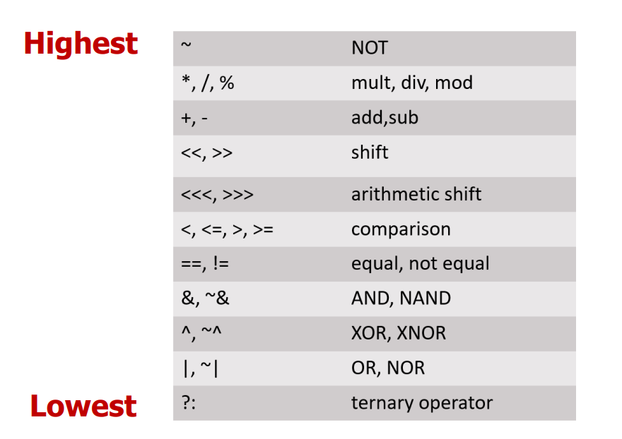

# **MEDS**
## *Digital design and Computer Architecture*
### ***Lecture # 4 (b, c) and 5 (a): Hardware Description Languages and Verilog***

We talked about in previous lectures how transistors are growing, and to keep up we need modified hardware design that have an error-free path to implementation. This includes the ability to specify complex designs, simulate their behavior (functional & timing) and to synthesize portions of it. Hardware design languages enable all of the above.

**Hardware Languages:** 
These are languages specifically for hardware design and are quite similar to each other making mapping from one language to another fairly simple.

*Verilog:*
- Developed in 1984 by Gateway Design Automation
- Became an IEEE standard (1364) in 1995
- More popular in US

*VHDL (VHSIC Hardware Description Language):*
- Developed in 1981 by the US Department of Defense
- Became an IEEE standard (1076) in 1987
- More popular in Europe

*SystemVerilog:*
- Introduced in 2002 as an extension of Verilog
- Standardized as IEEE 1800 in 2005
- Widely used for modern chip design and verification (UVM)

*Key design principles:*
1. Hierarchical Design:
    - Theres a heirarchy of modules where primitive gates are predefined and simple modules are built by instantiating these gates, complex modules are then made by simple modules.
    - Hierarchy controls complexity
2. Top-Down Design Methodology:
    - Start by defining the top-level module, then identify the sub-modules used to build up the top module. From there subdivide the sub-modules until you get to leaf cells (fundamental components)
3. Bottom-Up Design Methodology:
    - First recognize the components available to you as leaf cells, build bigger sub-modules using these building blocks. The sub-modules can now be combined together to build the top-level module in the design

**SystemVerilog:** 

*Module:* 
A module is the main building block in Verilog.

We first need to define:
- Name of the module
- Directions of its ports (e.g., input, output)
- Names of its ports
- Describe the functionality of the module

~~~
module example (
    input logic a, b, c,
    output logic y
);

    // logic here

endmodule
~~~

*Bus:* 
You can also define multi-bit Input/Output:
- [range_end : range_start]
- Number of bits: range_end – range_start + 1

~~~
input  logic [31:0] a;
output logic [7:0]  b;
~~~

*Bit Manipulation:*
- Bit Slicing
- Concatenation
- Duplication

~~~
assign y = a[7:4];        // slicing
assign z = {a[3], a[2]};  // concatenation
assign x = {4{a[0]}};     // duplication
~~~

*Basic Syntax:* 
- SystemVerilog is case sensitive: SomeName and somename are not the same!
- Names cannot start with numbers: 2good is not a valid name
- Whitespaces are ignored

*Two Main Styles of HDL Implementation:* 
1. Structural:
    - The module body contains gate-level description of the circuit
    - Describes how modules are interconnected
    - Each module contains other modules (instances) and interconnections between those modules

    ~~~
    and g1(y, a, b);
    ~~~

2. Behavioral:
    - The module body contains functional description of the circuit
    - Contains logical and mathematical operators
    - Level of abstraction is higher than gate-level

    ~~~
    assign y = (a & b) | c;
    ~~~

- Bitwise Operators:

    ~~~
    &  (AND) | (OR) ^ (XOR) ~ (NOT)
    ~~~

- Reduction Operators:

    ~~~
    assign y = &a;  // AND all bits
    ~~~

- Conditional Operators:

    ~~~
    assign y = sel ? d1 : d0;
    ~~~

*Precedence of Operations in Verilog:*

*Numbers:* 
Numbers are represented in the form: **N’Bxx** 
where N is number of bits, B is the base and xx is the number.

~~~
8'bxx (8 bit binary)
4'hxx (4 bit hexadecimal)
8'dxx (8 bit decimal)
(X = unknown and Z = High Impedence)
~~~

*Tri-State Buffers:* 
- 'z = floating (disconnected)
- Used in shared buses

~~~
assign y = enable ? a : 'z;
~~~

*Continous Assignment:* 
- Used for combinational logic

~~~
assign y = a & b;
~~~

*Always Block:* 
~~~
always @(sensitivity_list)
    statement;
~~~

*Sequential Logic (Flip-Flop):* 
~~~
always @(posedge clk)
    q <= d;
~~~
- posedge --> rising edge
- <= --> non-blocking assignment
- This creates memory

Why Memory?
- Value stays when clock doesn’t change, making it sequential

*Reset Types:* 
1. Asynchronous Reset
    ~~~
    always @(posedge clk or negedge reset)
        if (!reset) q <= 0;
        else q <= d;
    ~~~
2. Synchronous Reset
    ~~~
    always @(posedge clk)
        if (reset) q <= 0;
        else q <= d;
    ~~~

*Enable Signal:* 
~~~
if (enable)
    q <= d;
~~~

*Combinational Always Block:* 

~~~
always @(*) begin
    if (sel)
        y = a;
    else
        y = b;
end
~~~

Conditions:
- all inputs in sensitivity list (*)
- output assigned in all cases

*Latch Problem:* 
If you forget assignment, it can create a latch (unwanted memory):

~~~
if (sel)
    y = a;
~~~

*Blocking vs Non-Blocking:* 
1. Blocking (=):
    ~~~
    a = b;
    c = a;
    ~~~
    sequential execution

2. Non-blocking (<=):
    ~~~
    a <= b;
    c <= a;
    ~~~
    parallel execution

*Parameterized Modules:* 
~~~
module mux #(parameter WIDTH = 8) (
    input  logic [WIDTH-1:0] a, b,
    input  logic sel,
    output logic [WIDTH-1:0] y
);
    assign y = sel ? b : a;
endmodule
~~~

*Finite State Machines (FSM):* 

1. Next State Logic (Combinational):
    ~~~
    always @(*)
    case(state)
        S0: nextstate = S1;
        ...
    endcase
    ~~~
2. State Register (Sequential):
    ~~~
    always @(posedge clk)
    state <= nextstate;
    ~~~
3. Output Logic:
    ~~~
    assign out = (state == S0);
    ~~~

*What Happens with HDL Code?* 
1. Synthesis (i.e., Hardware Synthesis)
- Modern tools are able to map synthesizable HDL code into low-level cell libraries --> netlist describing gates and wires
- They can perform many optimizations however they can not guarantee that a solution is optimal
- Mainly due to computationally expensive placement and routing
algorithms
- Need to describe your circuit in HDL in a nice-to-synthesize way
2. Simulation
- Allows the behavior of the circuit to be verified without actually
manufacturing the circuit
- Simulators can work on structural or behavioral HDL
- Simulation is essential for functional and timing verification